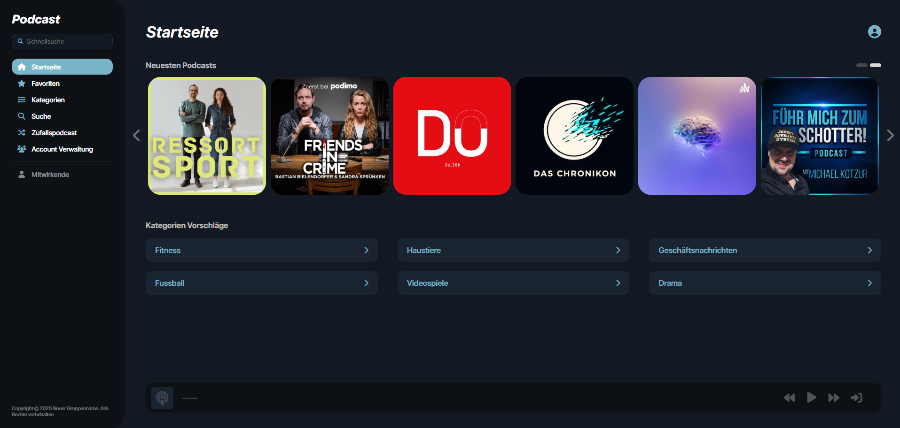

# PodcastWebApp

Ein Fullstack-Projekt für eine Podcast-Plattform, entwickelt mit HTML, CSS, JavaScript, Node.js und MongoDB. Das Projekt ist in ein Frontend (Client mit Webplayer) und ein Backend (Node.js API mit MongoDB-Anbindung) unterteilt und verwendet Docker zur Containerisierung sowie GitLab CI/CD zur Automatisierung.

Die Hauptordner enthalten den Frontend-Code (`frontend/`), den Backend-Server (`backend/`), Docker-Konfigurationen (`docker/`) sowie Screenshots (`screenshots/`). Die wichtigsten Konfigurationsdateien liegen im Projektstammverzeichnis.

## Technologien

- Frontend: HTML, CSS, JavaScript (Vanilla)  
- Backend: Node.js (Express)  
- Datenbank: MongoDB  
- Containerisierung: Docker & Docker Compose  
- CI/CD: GitLab  
- Versionierung: Git  

## Voraussetzungen

- Node.js (v18+ empfohlen)  
- MongoDB lokal oder remote (z. B. Atlas)  
- Docker & Docker Compose (optional für Deployment)  
- Git (für Klonen & Versionierung)

## Mitwirkende

Hier ist eine Liste mit allen Mitwirkenden des Podcast-Projekts:

- Lucas Tuscher
- Guilherme Ferreira de Mattos Nogueira Junior  
- Niclas Tredup  

## Bilder von der Podcast Webseite

 
